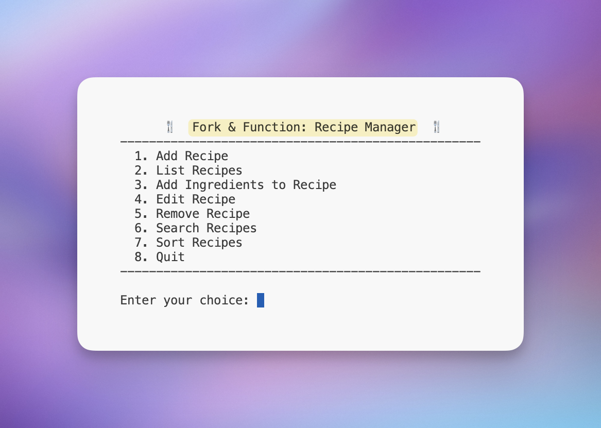
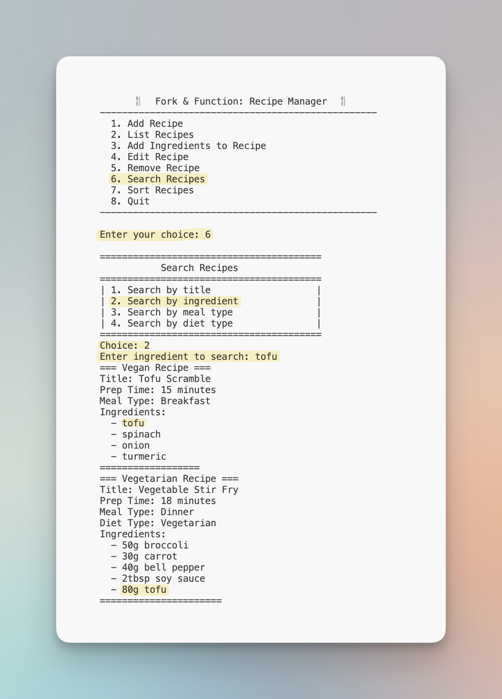
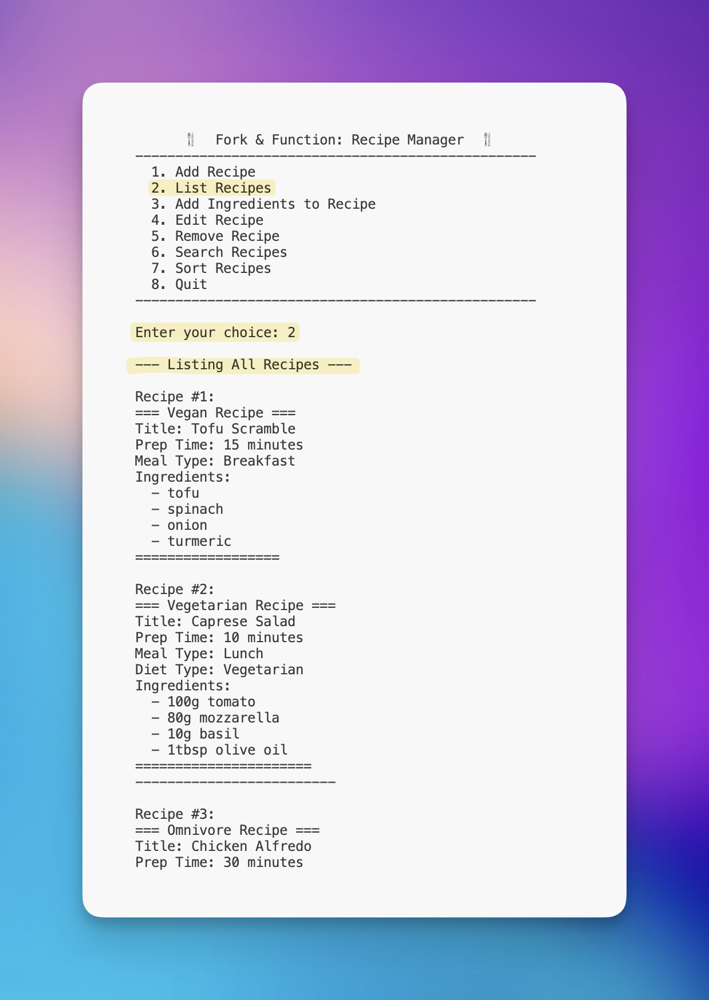
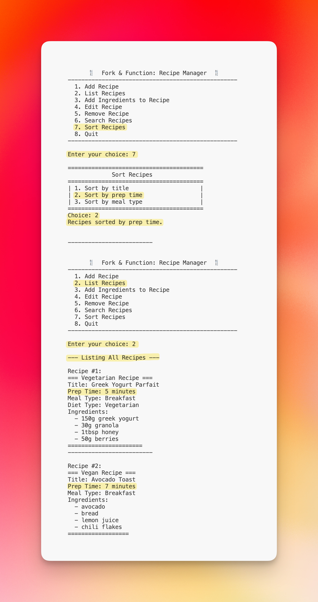
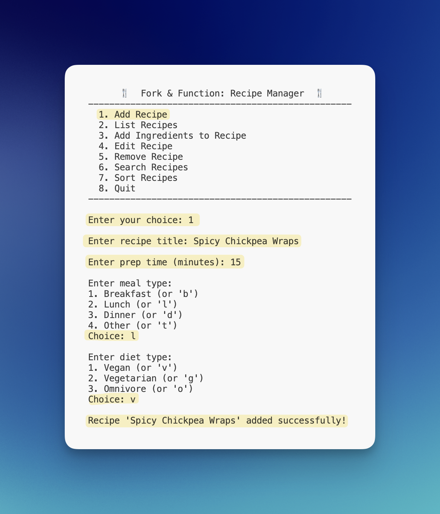
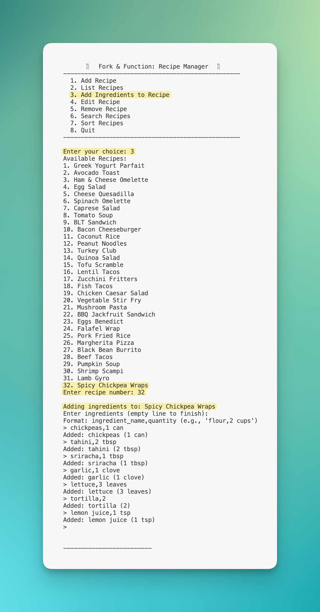

# Fork & Function — Recipe Manager
*Group 1: Austin Luong, Damian Perez, John Rilles, & Max Owens* 

## Overview
Fork & Function is a C++11 command‑line application built by a four‑member team. It showcases robust Object‑Oriented design, reusable data structures, and reliable persistence and search features. With advanced search/sort capabilities and a modular architecture, it delivers a seamless CLI experience.

## Key Features
- **Flexible Data Storage**  
  Templated `LinkedList<T>` for type‑safe, efficient collections of recipes and ingredients.  
- **Advanced Search & Sort**  
  Linear search across multiple fields and in‑list insertion sort for fast retrieval and ordering.  
- **Automatic Persistence**  
  Loads recipes from `recipes.txt` on startup and saves on exit, no extra steps required.  
- **Polymorphic OOP Design**  
  Abstract `Recipe` base class with `VeganRecipe`, `VegetarianRecipe`, and `OmnivoreRecipe` subclasses.  
- **Extensible Architecture**  
  UML‑driven design and clean separation of concerns make future enhancements straightforward.

## Architecture & Design
- **UML‑First Planning**  
  Complete class diagrams defined before coding to ensure maintainability.  
- **Header‑Only Templates**  
  Zero‑overhead `LinkedList<T>` implementation (`.h`/`.tpp`) for both recipes and ingredients.  
- **Central Controller**  
  `RecipeManager` orchestrates CRUD operations, searching, sorting, and file I/O.  
- **Resilient CLI**  
  Defensive input validation and meaningful feedback for all user interactions.

## Installation & Usage
```bash
# Clone the repository
git clone <repo-url>
cd recipe-manager

# Build
mkdir build && cd build
cmake ..
make

# Run
./recipe-manager
```

## Screenshots

### Main Menu


### Search by Ingredient


### List (Unsorted, Sample Data)


### List Sorted by Prep Time


### Add New Recipe


### Add Ingredients to New Recipe


## Project Structure

```tree
recipe-manager/
├── .gitignore
├── README.md
├── recipes.txt              # Recipe database with 50+ pre-loaded recipes
├── recipe-manager           # Compiled binary (after build)
├── src/
│   ├── main.cpp
│   ├── driver.h
│   ├── Recipe.h/.cpp
│   ├── VeganRecipe.h/.cpp
│   ├── VegetarianRecipe.h/.cpp
│   ├── OmnivoreRecipe.h/.cpp
│   ├── Ingredient.h/.cpp
│   ├── LinkedList.h/.tpp
│   ├── RecipeManager.h/.cpp
│   ├── MealType.h
│   ├── DietType.h
├── docs/
│   ├── UML.png              # UML class diagram
│   ├── Proposal.pdf         # Project proposal document
│   └── images/
│       ├── main_menu.png
│       ├── search_ingredient.png
│       ├── list_unsorted.png
│       ├── list_sorted.png
│       ├── add_recipe.png
│       └── add_ingredients.png
```

- See `docs/UML.png` for the full class diagram.
- See `docs/Proposal.pdf` for the original project proposal.

## Future & Recap
### Completed Phases
- **Phase 1:** UML design and planning
- **Phase 2:** Core data structures and enums
- **Phase 3:** Recipe and ingredient management
- **Phase 4:** Persistence, search, and sort
- **Phase 5:** CLI polish and error handling

### Skipped
- Additional diet types
- Nutrition data
- GUI interface
- User authentication
- Recipe scaling

### Future Functionality Ideas
- GUI interface
- Nutrition module
- User accounts
- Import/export recipes
- Step-by-step instructions
- Grocery list generation

---

For questions or contributions, please open an issue or submit a pull request.

Special thanks to Professor Corey Carito for guidance.