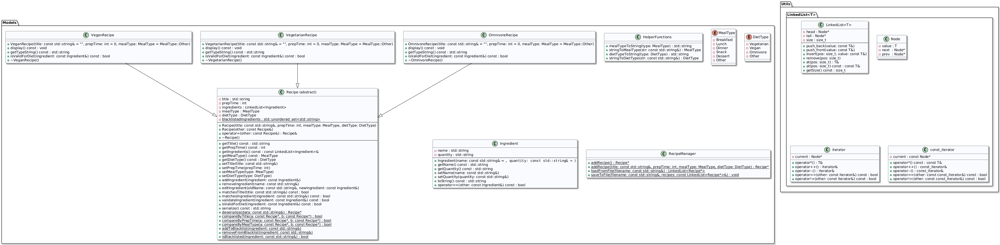

# Fork & Function: Recipe Manager

## Project Overview
A C++ recipe management system that helps users organize and filter recipes based on dietary preferences and ingredients.

## Current Features
- **Comprehensive Recipe Management:**
  - Add new recipes specifying title, preparation time, meal type (`breakfast`, `lunch`, `dinner`, `snack`, `dessert`), and diet type (`vegan`, `vegetarian`, `omnivore`).
  - Add multiple ingredients with name and quantity to existing recipes using a bulk entry format.
  - List all stored recipes, displaying their details.
  - Search recipes by title, ingredient, meal type, or diet type.
  - Sort recipes by title, preparation time, or meal type (using insertion sort).
  - Edit existing recipes (title, prep time, meal type).
  - Remove recipes with confirmation.
- **Data Persistence:**
  - Automatically save the current recipe list to a file upon exit.
  - Automatically load recipes from the file on program startup.
  - Serialized storage format for complete recipe data.
- **Foundation:**
  - Object-oriented design with `Recipe` inheritance (`VeganRecipe`, `VegetarianRecipe`, `OmnivoreRecipe`).
  - Custom **doubly-linked** `LinkedList` template class for managing recipes and ingredients.
  - Ingredient validation and blacklist system.
  - Enums (`MealType`, `DietType`) are defined in their own headers (`MealType.h`, `DietType.h`) for UML compliance.

## UML Diagram & Structure
This project was designed to closely follow a UML diagram for clarity and maintainability. The UML describes the following relationships:

- **Enums:**
  - `MealType` and `DietType` are defined in their own headers and used throughout the project for type safety and clarity.
- **Ingredient:**
  - Represents a single ingredient with a name and quantity. Used as a value type in recipes.
- **LinkedList<T>:**
  - A custom **doubly-linked** list template class, used for both `Ingredient` and `Recipe` storage. Supports iterators, search, and insertion sort.
- **Recipe (abstract):**
  - Base class for all recipes. Contains fields for title, prep time, meal type, diet type, and a `LinkedList<Ingredient>`. Provides virtual and pure virtual methods for extensibility.
- **VeganRecipe, VegetarianRecipe, OmnivoreRecipe:**
  - Inherit from `Recipe` and implement diet-specific validation and display logic.
- **RecipeManager:**
  - Static utility class for creating recipes and handling file I/O. Provides both interactive and non-interactive (UML-compliant) factory methods.

**UML Relationships:**
- Inheritance: `VeganRecipe`, `VegetarianRecipe`, `OmnivoreRecipe` inherit from `Recipe`.
- Composition: `Recipe` has a `LinkedList<Ingredient>`.
- Templates: `LinkedList<T>` is used for both pointer and value types.
- Enums: Used for meal and diet types throughout the codebase.

## UML Diagram
 

## Implementation Details
- **OOP Design**:
  - Abstract `Recipe` base class with pure virtual methods
  - Specialized recipe types (Vegan, Vegetarian, Omnivore) with diet-specific validation
  - Ingredient class with name and quantity management
  - Polymorphic recipe hierarchy for extensible design

- **Data Structures**:
  - Custom **doubly-linked** `LinkedList<T>` template class with iterator support
  - Efficient ingredient storage and management
  - Sorting and searching algorithms (insertion sort for sorting)
  - Manual memory management with careful use of destructors

- **Templates & Polymorphism**:
  - `LinkedList<T>` template class for flexible data storage
  - Polymorphic recipe hierarchy for extensible design
  - Iterator implementation for standard-library compatibility
  - Type-safe ingredient validation

## Building and Running
```bash
# Compile the project (C++11 or newer required)
g++ -std=c++11 src/*.cpp -o recipe-manager

# Run the program (Mac/Linux)
./recipe-manager

# On Windows, use:
recipe-manager.exe
```

## How to Use
When you run the program, you'll see a menu like this:
```
========================================
   🍴  Fork & Function: Recipe Manager  🍴
========================================
| 1. Add Recipe                      |
| 2. List Recipes                    |
| 3. Add Ingredients to Recipe        |
| 4. Edit Recipe                     |
| 5. Remove Recipe                   |
| 6. Search Recipes                  |
| 7. Sort Recipes                    |
| 8. Quit                            |
========================================
```
- Choose an option by entering its number.
- Add recipes, ingredients, search, sort, and more—all from the command line.
- All changes are saved automatically when you quit.

> **Note:** All submenus (such as search and sort) use similar clear formatting and borders for a consistent, user-friendly experience.

## Project Structure
```
src/
├── Recipe.h/cpp         # Abstract base class
├── VeganRecipe.h/cpp    # Vegan recipe implementation
├── VegetarianRecipe.h/cpp
├── OmnivoreRecipe.h/cpp
├── Ingredient.h/cpp     # Ingredient management
├── LinkedList.h/tpp     # Custom doubly-linked list implementation
├── RecipeManager.h/cpp  # Recipe creation and management
├── MealType.h           # Enum for meal types
├── DietType.h           # Enum for diet types
└── main.cpp             # Program entry and UI
```

## File Format: recipes.txt
Each recipe is stored as a single line in the following format:
```
Type|Title|PrepTime|MealType|DietType|ingredient1:quantity1;ingredient2:quantity2;...
```
- **Type**: Vegan, Vegetarian, or Omnivore
- **Title**: Recipe name
- **PrepTime**: Preparation time in minutes (integer)
- **MealType**: Breakfast, Lunch, Dinner, Snack, Dessert, or Other
- **DietType**: Vegan, Vegetarian, Omnivore, or Other
- **Ingredients**: Each ingredient is `name:quantity`, separated by semicolons

**Example:**
```
Vegan|Tofu Scramble|15|Breakfast|Vegan|tofu:200g;spinach:50g;onion:30g;turmeric:1tsp
```

## Development Status
### Completed Features ✓
- Basic recipe class hierarchy with inheritance
- Custom **doubly-linked** `LinkedList<T>` implementation with iterators
- Recipe management (add, edit, remove)
- Ingredient management with validation
- File I/O with serialization
- Search functionality
- Sort functionality (insertion sort)
- Diet-specific ingredient validation
- Blacklist system for ingredients
- UML-compliant enums and file structure

### Future Enhancements
- Refactor main for simplicity
- Recipe instructions and steps
- Enhanced recipe categories and tags
- Recipe export/import functionality
- GUI interface
- Recipe scaling functionality
